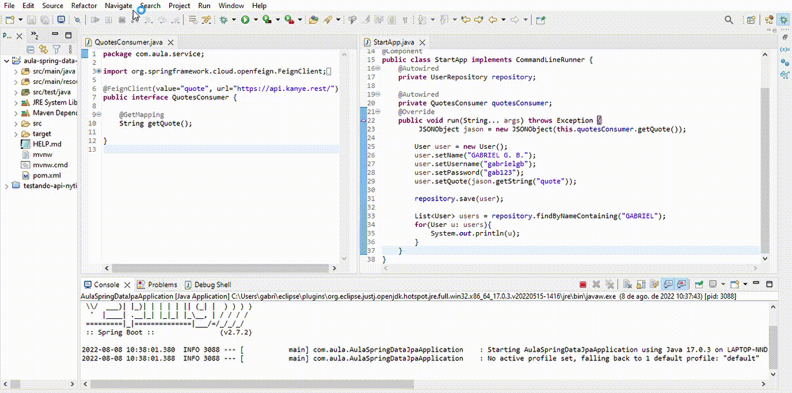

<h1>Explorando Padrões de Projetos na Prática com Java</h1>

Projeto criado para fixar os Padrões de Projeto explorados durante a aula

# Sobre

Projeto foi desenvolvido utilizando SpringBoot Framework para gravar dados de usuário na H2 Database utilizando Spring Boot JPA

Na Classe de usuário a ser gravada, foi implementada uma nova classe de "Quotes" onde através do Spring Cloud OPENFein é consumida a API https://api.kanye.rest/ onde é 
gerada alguma frase aleatória dita por Kanye West

# Resultado

<h1 align="center">
  
</h1>
